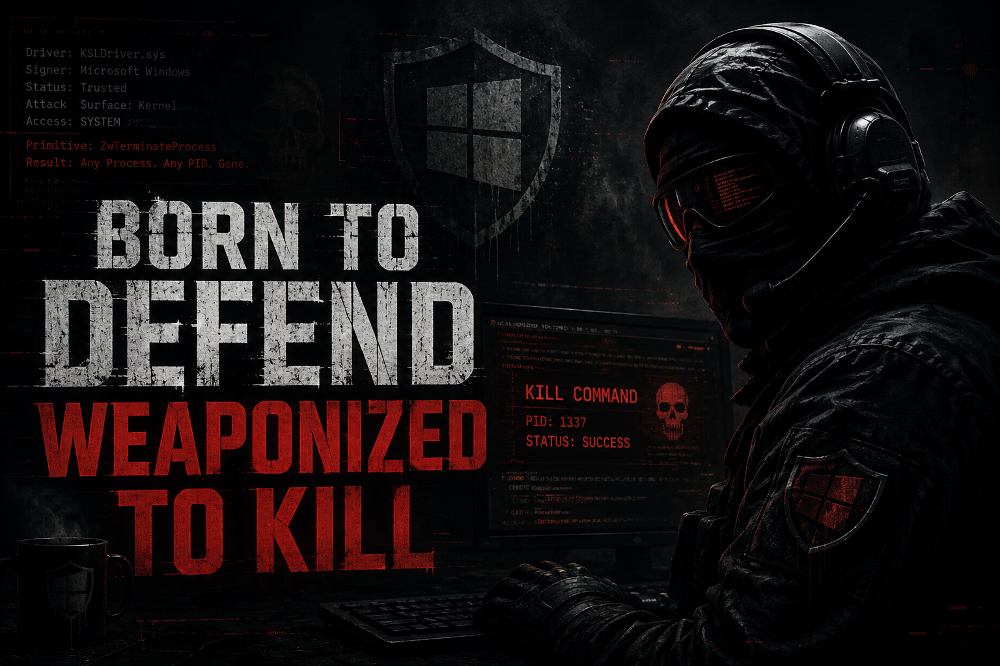

# DefenderKiller



**Kernel process termination using Microsoft's own signed driver.**

KSLDriver.sys (2011) — a Microsoft Malware Protection driver signed by Microsoft Code Signing PCA — contains a `ZwTerminateProcess` primitive accessible via IOCTL from ring 0. DefenderKiller weaponizes this driver to terminate any process on the system, including PPL-protected and EDR-protected processes.

## ⚠️ Disclaimer

This tool is provided for **authorized security testing and educational purposes only**. Use only on systems you own or have explicit written permission to test. The author is not responsible for any misuse.

## 📝 Blog Post

Full reverse engineering writeup and technical breakdown:

**[Born to Defend, Weaponized to Kill: Weaponizing Microsoft's Own Driver to Kill EDRs](https://medium.com/@jehadbudagga/born-to-defend-weaponized-to-kill-weaponizing-microsofts-own-driver-to-kill-edrs-af4b85c1a43c)**

## Why This Is Different

Every BYOVD tool out there relies on third-party drivers. DefenderKiller uses **Microsoft's own signed Defender driver** against itself.

- **0/70 detection** on VirusTotal
- **Microsoft Code Signing PCA** signed — trusted at the highest level
- **Not on the Vulnerable Driver Blocklist** — Microsoft excludes their own drivers by design
- **Bypasses PPL** — `ZwTerminateProcess` from kernel mode ignores Protected Process Light
- **Bypasses ObRegisterCallbacks** — `ZwOpenProcess` from ring 0 skips EDR handle protection
- **Survives April 2026 driver trust policy** — WHCP attestation-signed drivers are still trusted

## How It Works

1. Load the Microsoft-signed KSLDriver.sys with a custom service
2. Bypass the `AllowedProcessName` check by writing our own path to the registry
3. Send IOCTL `0x222044` sub-command 8 with the target PID
4. Close the handle — `IRP_MJ_CLEANUP` fires `ZwTerminateProcess` from kernel mode
5. Target process terminated. No callback intercepts it. No protection blocks it.

## Usage

```
DefenderKiller.exe load C:\path\to\KSLDriver_2011.sys
DefenderKiller.exe kill <PID or process name>
DefenderKiller.exe unload
```

### Example

```
C:\> DefenderKiller.exe load C:\KSLDriver_2011.sys
[+] Loaded

C:\> DefenderKiller.exe kill CSFalconService.exe
[+] Killed 4628

C:\> DefenderKiller.exe unload
[+] Unloaded
```

## Driver Details

| Property | Value |
|----------|-------|
| **File** | KSLDriver.sys |
| **Description** | Microsoft Malware Protection - KSLDriver |
| **Product** | Microsoft Malware Protection |
| **Version** | 1.1.0013.0 |
| **Size** | 34.83 KB (35,664 bytes) |
| **Architecture** | x64 (64-bit native) |
| **Date Signed** | September 16, 2011 |
| **Signer** | Microsoft Corporation |
| **Certificate** | Microsoft Code Signing PCA → Microsoft Root Authority |
| **Detection** | **0/70** on VirusTotal |
| **SHA-256** | `d5764d24e78914ab2a9db6b24e323342d0b37998f43add1a9e49b00992b0d645` |
| **MD5** | `0ebb390b7aeec45ec061d9870a34fd42` |
| **SHA-1** | `7772c1215e31836cc8d830cb65f224ec929cfb69` |
| **Imphash** | `8bf2a95defbf5214f859fd3f24f64e5f` |
| **Authentihash** | `0a19385f73a265d8086a8b1304873110ce33a37ce08d442b9fb9390c82fa50e7` |
| **VirusTotal** | [Full Analysis](https://www.virustotal.com/gui/file/d5764d24e78914ab2a9db6b24e323342d0b37998f43add1a9e49b00992b0d645) |

## Tested Against

| EDR | Process | Result |
|-----|---------|--------|
| CrowdStrike Falcon | CSFalconService.exe | ✅ Killed |
| Windows Defender | MsMpEng.exe | ✅ Killed |

## Note

This is a simple POC that demonstrates the kill primitive. Some EDRs will respawn their processes through a watchdog service or a secondary kernel component. To handle that, you can weaponize this further by running the kill in a loop targeting all known EDR process names.

## Author

**Jehad Abudagga**

[](https://x.com/j3h4ck)
[](https://www.linkedin.com/in/jehad-abudagga)
[](https://medium.com/@jehadbudagga)
[](https://github.com/redteamfortress)
